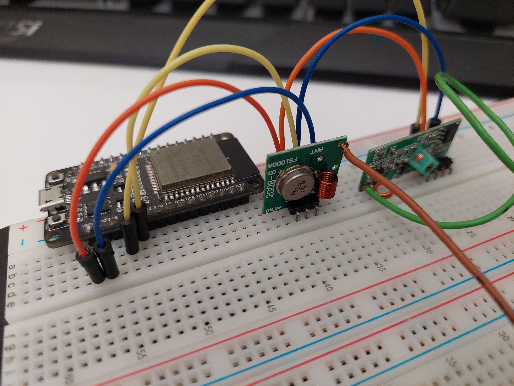

# <p align="center">RF-TechCat</p>

<p align="center">
  
</p>

<p align="center">
  
  
</p>

## <p align="center">RF-TechCat - clones your 433MHz keys</p>
## <p align="center"> Please support my job with GitHub Star this repository</p>
## <p align="center">For what Am I made & used for ?</p>

- Copying & replaying 433 MHz Signal captured from somewhere :D
- Savind & next time replaying signals
- ```universal Remote Control```

# What to buy ?
  - esp32 - 4€
  - Breadboard - 3€
  - Arduino rcswitch compatible 433MHz receiver & transmitter both about 2€
  - Jumper wires Male-Male 1€

## Connection
### Rcswitch

| Transmitter pins | esp32 pins  |
| ---------------  | ----------- |
| VCC              | 3.3V        |
| Pin              | D4          |
| GND              | GND         |

| Receiver pins | esp32 pins  |
| ------------- | ----------- |
| VCC           | 3.3V        |
| Pin           | D2          |
| GND           | GND         |

## <p align="center">how it looks like ?</p>
<p align="center"></p>

| Tested              | status | works on % | additional |
| ------              | ------ | ---------- | --- |
| Receive   Strenght  | ✅    |  90 - 100  | Depends on antenna |
| Transmit  Strenght  | ✅    |  98 - 100  | Depends on antenna |
| Save signal         | ✅    |  100       | depends on EEPROM |


## Note 📝
### Antenna
- Recomnended length of antenna for:
  - 433mhz Transmitter: ~17.3 cm it is 1/4 λ
  - 433mhz Transmitter: ~17.3 cm, for sensitive signals use 20 cm or longer

---

### cc1101

  - code DOES NOT WORKS as expected

| cc1101 pins | esp32 pins |
| ----------- | ---------- |
| VCC         | 3.3V       |
| GND         | GND        |
| SCK         | GPIO 18    |
| MISO        | GPIO 19    |
| MOSI        | GPIO  23   |
| CS          | GPIO 5     |
| GDO0        | GPIO 21    |
| GDO2        | GPIO 22    |

## <p align="center">How to control me ?</p>

- Easy by using WEB Interface

| SSID         | ESP32_Control       |
| ------------ | ------------------- |
| Password     | LINE 9 in .ino code |

- Open your browser, type there 192.168.4.1, hit enter
- its now a little in experimental demo version, **but it works :D**

## Functions
  - [x] Support 24 Bit
  - [x] Receive & Save signal
  - [x] Transmit signal
  - [x] Store to memory up to 15 signals
  - [x] & [❌] cc1101 - **unstable**
  - [x] Nice looking Web, easy controling
  - [ ] Supports RollJam
  - [x] Rolling Codes

## Todo
  - add RollJam with time to set (e.g. 5 seconds, 10, 30, 1 min)
  - add Rolling Codes (From xxxxxxx to xxxxxxxx) --> ```max value for 24 Bit is 16777215 !```
  ### add ```better & stable``` support for cc1101

## List of fixed bugz
| bug name or in short   | Fixed ? | 
| ---------------------- | ------- |
| Popup status window    | ✅     |
| allow RE-name of file  | ✅     |
