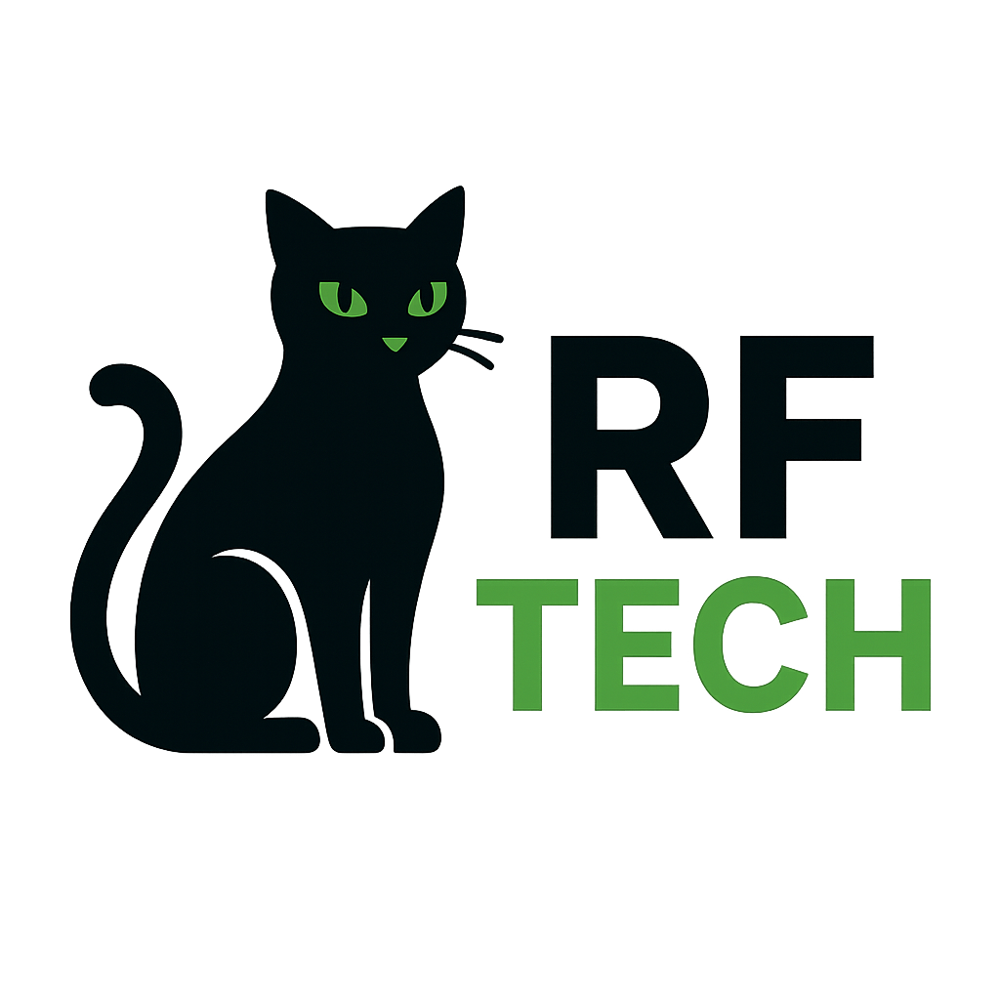

# <p align="center">RF-TechCat</p>

<p align="center">
  
</p>

<p align="center">
  
  
</p>

## <p align="center">RF-TechCat - clones your 433MHz keys</p>

## <p align="center">For what Am I made & used for ?</p>

- Copying & replaying 433 MHz Signal captured from somewhere :D
- Savind & next time replaying signals
- ```universal Remote Control```

## <p align="center">How to control me ?</p>

- Easy by using WEB Interface


| SSID             | ESP32_Control    | CHANGE_ME (Default) |
| ---------------- | ---------------- | ----------------    |
| Password         | 12345678         | CHANGE ME (Default) |

- Open your browser, type there 192.168.4.1, hit enter

## Functions
  - [x] Support 24 Bit
  - [x] Receive & Save signal
  - [x] Transmit signal
  - [x] Store to memory up to 15 signals
  - [ ] cc1101
  - [x] Nice looking Web, easy controling
  - [ ] Supports RollJam
